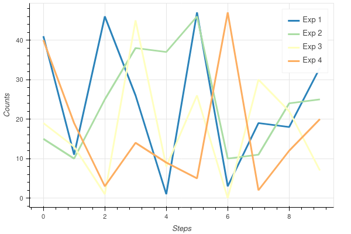
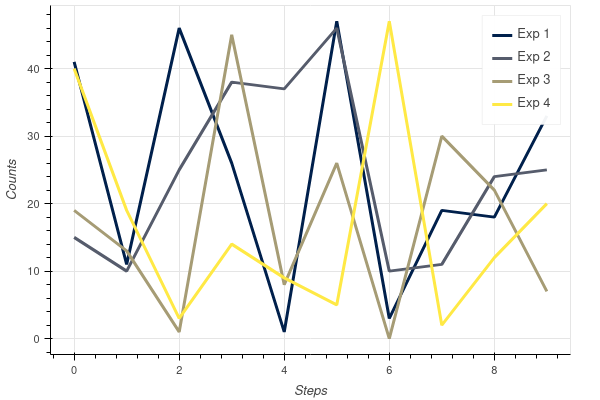

The "key" plotting library for Python is Matplotlib. Especially for me, it is simple and nice because of Matlab-like syntax which simplified transition to it years ago. However, default Matplotlib output is not so nice as one would like to have and a long time it was used by me as an intermediate support to show some data before further processing via Pgfplots. There are nice alternatives for people who is very into statistics like Plotly or Seaborn, but for "normal" plots their syntax looks too complicated and not obvious for me. However, I still want to have some interactivity in Jupyter notebooks and have recently noticed functionality of Bokeh.

First, one need to install necessary packages:
```bash
$ pip3 install -U bokeh jupyter_bokeh selenium
$ sudo dnf install chromedriver
```
Here, `selenium` and `chromedriver` are needed for exporting results to png/svg formats I need for further image processing.

Initialization of the Jupyter notebook looks as follows:
```python
import bokeh.plotting as bk # plotting
import bokeh.io as bkio     # export
bkio.output_notebook()
```
The last line is needed to embed figures into the notebook. Otherwise they are opened in a new browser tab.

One should note that interactive figures are not saved in the `ipynb` file and should be regenerated each time notebook is opened.

## Basic plots
Let's generate a few curves with random numbers for future use:
```python
N = 10
xx = np.arange(N)
yy1 = np.random.randint(0, 50, size=N)
yy2 = np.random.randint(0, 50, size=N)
yy3 = np.random.randint(0, 50, size=N)
yy4 = np.random.randint(0, 50, size=N)
```

This is the object dealing with the plot of size 600 by 400 pixels and given axes labels:
```python
fig = bk.figure(width=600, height=400, x_axis_label='Steps', y_axis_label='Counts')
```
This allows generate a figure consisting of two curves: one connecting points by lines and another just with symbols:
```python
fig.line(xx, yy1)
fig.circle(xx, yy1)
bk.show(fig)
```

Other types of plots can be achieved with commands like `fig.circle_cross` etc, see the full list [here](https://docs.bokeh.org/en/latest/docs/reference/plotting/figure.html).

Legend can be added with the `legend_label` keyword for the given curve.

## Iteration over colors
There is no automatic color choice for the sequential objects in the plot. Thus following [discussion](https://stackoverflow.com/questions/39839409/when-plotting-with-bokeh-how-do-you-automatically-cycle-through-a-color-pallett), one should import one of Bokeh palettes and iterate over it manually. List of all palettes can be found [here](https://docs.bokeh.org/en/latest/docs/reference/palettes.html). 

To have a cycling over the given palette it is useful to utilize `itertools`. In the following example, we import one of palettes and make a few plots with the respective colors, also adjusting the line width and legend:
```python
from bokeh.palettes import Spectral5
import itertools 

color = itertools.cycle(Spectral5)

fig = bk.figure(width=600, height=400, x_axis_label='Steps', y_axis_label='Counts')
fig.line(xx, yy1, color=next(color), line_width=3, legend_label='Exp 1')
fig.line(xx, yy2, color=next(color), line_width=3, legend_label='Exp 2')
fig.line(xx, yy3, color=next(color), line_width=3, legend_label='Exp 3')
fig.line(xx, yy4, color=next(color), line_width=3, legend_label='Exp 4')
bk.show(fig)
```


There are smooth palettes like `cividis` or `viridis`, which can be used as follows:
```python
from bokeh.palettes import cividis
import itertools 

color = itertools.cycle(cividis(4)) # cycling over 4 colors

fig = bk.figure(width=600, height=400, x_axis_label='Steps', y_axis_label='Counts')
fig.line(xx, yy1, color=next(color), line_width=3, legend_label='Exp 1')
fig.line(xx, yy2, color=next(color), line_width=3, legend_label='Exp 2')
fig.line(xx, yy3, color=next(color), line_width=3, legend_label='Exp 3')
fig.line(xx, yy4, color=next(color), line_width=3, legend_label='Exp 4')
bk.show(fig)
```
